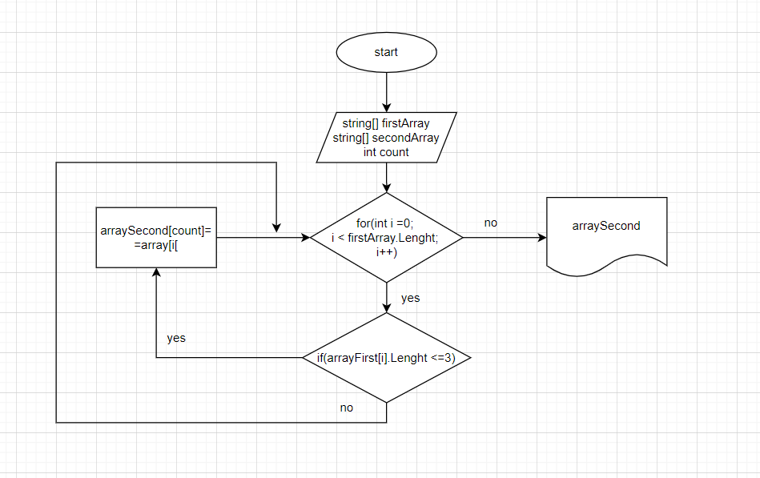

# Финальный проект
**Добрый день!**

______
В данном проекте была поставлена следующая **задача**: написать программу, которая из имеющегося массива строк формирует массив из строк, длина которых меньше либо равна 3 символа. Первоначальный массив можно ввести с клавиатуры, либо задать на старте выполнения алгоритма. При решении не рекомендуется пользоваться коллекциями, лучше обойтись исключительно массивами.
______
Ниже представлена блок-схема алгоритма для решения задачи:

______

Этапы решения задачи:
1. С клавиатуры вводится количество элементов массива, затем пользователь самостоятельно вводит элементы массива.
2. Создается пустой массив, размер которого равен первому, в который в дальнейшем будут записываться элементы, удовлетворяющие заданному условию: количество символов элемента больше либо равно трем.
3. После этого начинается цикл и продолжаеся до тех пор, пока не будут проверены все элементы первого массива на соответствие условию задачи. Если элемент удовлетворяет условию, то он записывается во второй массив.
4. По завершению цикла выводится первый и второй массивы.

Познакомиться с кодом можно здесь: final_task\Program.cs
